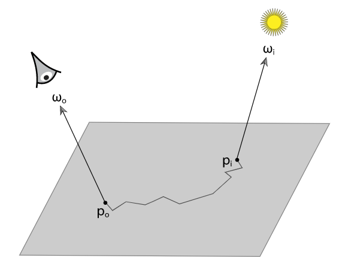
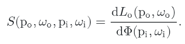
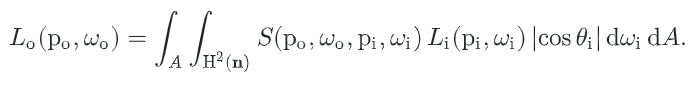
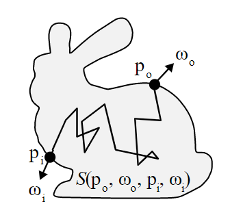
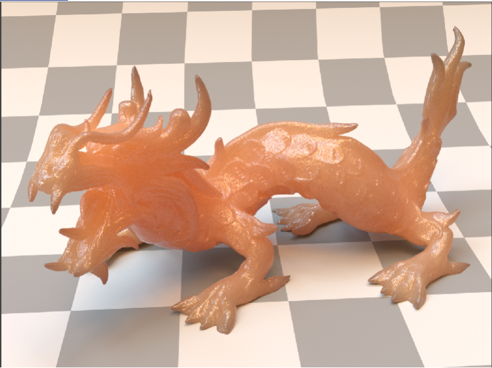
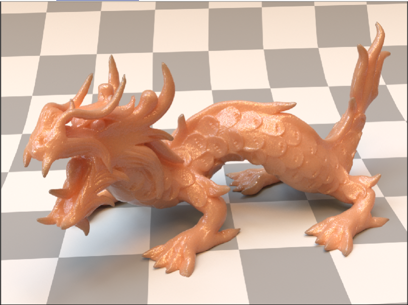
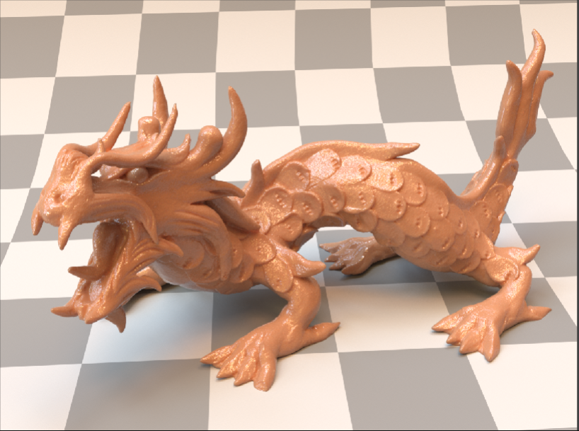

# Subsurface scattering

PBRT breaks the BSSRDF into three components:
- BSSRDF (base)
- Separable BSSRDF
    - Extends the base class to be more general and handle different types of geometry
- Tabulated BSSRDF
    - Extends separable with real world scattering data

## PBRT
### [5.6.2: The BSSRDF](http://www.pbr-book.org/3ed-2018/Color_and_Radiometry/Surface_Reflection.html#TheBSSRDF)
<!--  -->
<!--  -->
<!--  -->

- How much of the incident light leaves the surface after it gets scattered
- Need to integrate over the surface area and the incoming direction
- As the distance between the entry and exit points increase, the BSSRDF, *S*, decreases 

### [11.4: The BSSRDF](http://www.pbr-book.org/3ed-2018/Volume_Scattering/The_BSSRDF.html)

- Details the `BSSRDF` class

- *S* gives the scattering outcome given two points and directions on the surface boundary

### 15.4: Sampling Subsurface Reflection Functions


- Compute the fraction of incident light from *wi* at *pi* that exits the object at *po* in *wo*.

- High albedo objects
    - 0.9987
    - Milk
        - 100 scattering events --> 87.5% of the light is still being able to travel
        - 500 scattering events --> 51%
        - 1000 scattering events --> 26%
        - Not really sure how this is measured
    - Most of the light is scattered in the medium which leaves very little to be absorbed and allows light to travel pretty far in the medium.
    
- `Sample_S()` gets the exit point after scattering

As the scattering coefficients increase, the more opaque the object gets.
| Property      | Image                         |       |
|   :----:      |   :---:                       | :---: |
| Low Density   |    |       | 
| Medium Density|    | coeffs scaled by 5 |
| High Density  |   | coeffs scaled by 25 |


### 15.4.1: Sampling the SeparableBSSRDF 
- There are three components to the BSSRDF
    - Fresnel probability
        - We only want to sample rays transmitted through the surface
        - Energy lost when the rays bounce around and *leave* the surface (graphics guy)
    - Spatial/radial profile function *Sp = Sr*
        - `Sample_Sp()` which is called from `Sample_S()` and finds the exit point
        - This also has sample the color channels for spectral variation
        - Creates a linked list of intersections 
            - We randomly choose one 
        - Approximate falloff factor between entry and exit points (graphics guy)
    - Sample weight *Sw* is a diffuse like term scaled by fresnel
        - I think this samples the BxDF
        - Light energy lost from light *entering* the surface (graphics guy)

### 15.4.2: Sampling the TabulatedBSSRDF

### 15.4.3: Subsurface Scattering in the Path Tracer
```
if(isx.material == BSSRDF)
{
    // Importance sample BSSRDF
    {
        // get exit point pi
        Color S = isx.bssrdf->Sample_S(&pi, &pdf); 
        if(S == black || pdf == 0)
            break;

        beta *= S / pdf;
    }

    // Direct lighting
    {
        L += beta * SampleLight();
    }

    // Indirect lighting
    {
        Color f = pi.bsdf->Sample_f(&wi, &pdf);  // Get next ray
        if(f == black || pdf == 0)
            break;
        
        beta *= f * absdot(wi, pi.normal) / pdf;
        ray = pi.spawnRay(wi);
    }
}
```


### 15.5: Subsurface Scattering Using the Diffusion Equation
- Initialize `TabulatedBSSRDF` with *Sr*
    - The goal of `TabulatedBSSRDF` is to accurately describe the subsurface scattering properties (coefficients, phase function, IOR)
- Photon Beam Diffusion
    - Accounts for all the light transport by tracking all orders of scattering
    - Assumptions and Approximations
        - **Diffusion approximation** - how light is equally distributed in thick and highly scattering media
        - Homogenous
        - Medium is semi-infinite
        - Builds upon separable BSSRDF - spatial and directional scattering distribution is multiplicative
    - Can compute *Sr*
        - Need to invert CDF of *Sr* to importance sample
            - jesus christ
        


## Jensen Paper
- Translucent materials exhibit scattering and light transport below the surface.
- Previous work (hundreds of bounces before exiting the material)
    - Photon mapping
    - Scattering functions
    - Diffusion theory
- Diffusion theory was extended
    - Exact single scattering
    - Arbitrary geometry
    - Rendering sampling technique
- **Radial reflectance profile**

## Resources
- https://agraphicsguynotes.com/posts/practical_tips_for_implementing_subsurface_scattering_in_a_ray_tracer/
    - https://github.com/JiayinCao/SORT/blob/master/src/integrator/pathtracing.cpp
- https://gao-duan.github.io/blogs/bssrdf/index.html
    - https://github.com/gao-duan/EDXRay/blob/master/EDXRay/Integrators/PathTracing.cpp
- PBRT